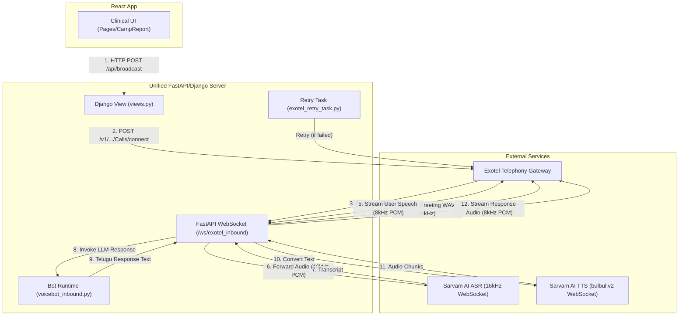

# Flow Diagram

```mermaid
flowchart TD
    subgraph Frontend [React App]
        UI["Clinical UI (Pages/CampReport)"]
    end

    subgraph Backend [Unified FastAPI/Django Server]
        API["Django View (views.py)"]
        WS["FastAPI WebSocket (/ws/exotel_inbound)"]
        Retry["Retry Task (exotel_retry_task.py)"]
        BotService["Bot Runtime (voicebot_inbound.py)"]
    end

    subgraph External [External Services]
        Exotel["Exotel Telephony Gateway"]
        SarvamASR["Sarvam AI ASR (16kHz WebSocket)"]
        SarvamTTS["Sarvam AI TTS (bulbul:v2 WebSocket)"]
    end

    %% Triggering Flow
    UI -->|"1. HTTP POST /api/broadcast"| API
    API -->|"2. POST /v1/.../Calls/connect"| Exotel
    Retry -->|"Retry (if failed)"| Exotel

    %% Call Connection Flow
    Exotel -->|"3. Connects Stream"| WS
    WS -->|"4. Send Greeting WAV (8kHz)"| Exotel

    %% Conversation Loop
    Exotel <-->|"5. Stream User Speech (8kHz PCM)"| WS
    WS -->|"6. Forward Audio (16kHz PCM)"| SarvamASR
    SarvamASR -->|"7. Transcript"| WS
    WS -->|"8. Invoke LLM Response"| BotService
    BotService -->|"9. Telugu Response Text"| WS
    WS -->|"10. Convert Text"| SarvamTTS
    SarvamTTS -->|"11. Audio Chunks"| WS
    WS -->|"12. Stream Response Audio (8kHz PCM)"| Exotel
```
