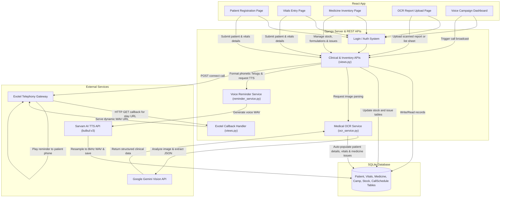

# Flow Diagram

The diagram below represents the end-to-end architecture and data flow of the SWASTH Medical Camp System, mapping frontend modules, backend API services, SQLite databases, and external API gateways.

